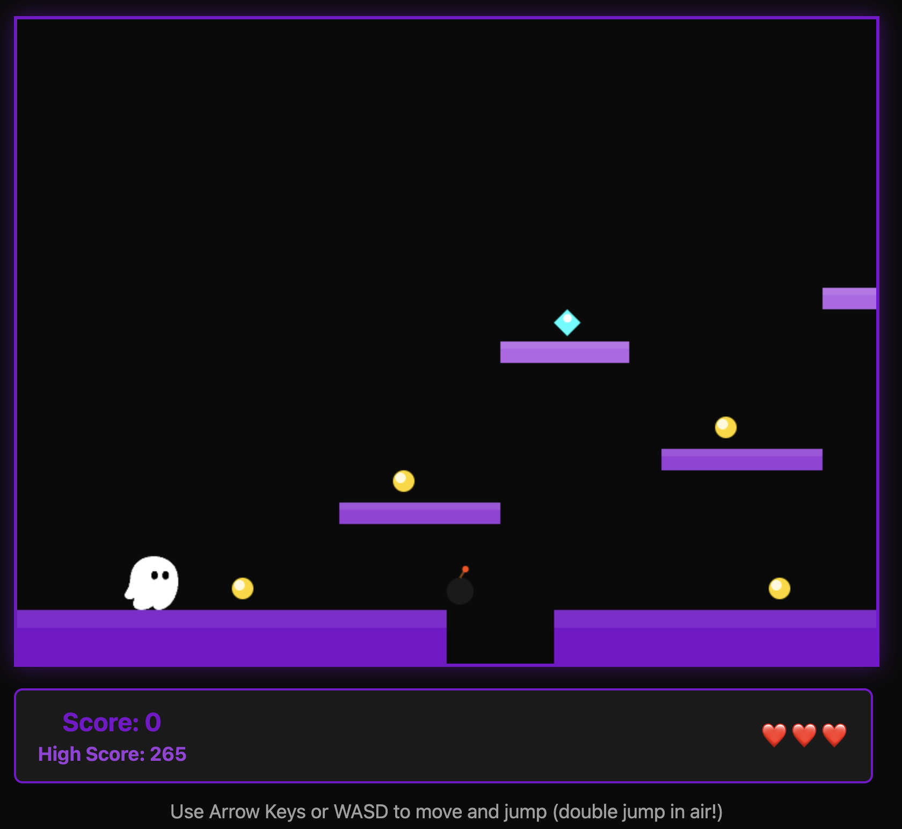

# Super Kiro World 🎮

A browser-based 2D platformer game featuring the Kiro mascot, built with vanilla JavaScript and HTML5 Canvas.



## 🎯 About

Super Kiro World is a side-scrolling platformer where you guide Kiro through challenging levels, collecting coins and gems while avoiding obstacles. Built as part of the AWS Re:Invent workshop to demonstrate game development with vanilla JavaScript.

## 🕹️ How to Play

### Controls
- **Arrow Keys** or **WASD**: Move left/right and jump
- **Space/Up/W**: Jump (can be used multiple times... 🤔)
- **R**: Restart the game

### Objective
- Collect coins (10 points) and gems (25-50 points)
- Navigate platforms to reach the goal
- Don't lose all your lives!
- Explore thoroughly... some say there's more than meets the eye 👀

## 🚀 Getting Started

No installation or build process required! Simply:

1. Clone this repository
   ```bash
   git clone https://github.com/danigirl329/kiro-game-challenge.git
   cd kiro-game-challenge
   ```

2. Open `index.html` in your web browser

3. Start playing!

## 🎨 Features

- **Smooth Physics**: Custom gravity and collision detection
- **Scrolling Camera**: Follows the player through the level
- **Score System**: Track your points and lives
- **Collectibles**: Coins and gems with different values
- **Responsive Controls**: Immediate feedback to player input
- **Kiro Branding**: Official Kiro colors and logo sprite
- **Hidden Secrets**: Legends speak of a place beyond the clouds... but only the most skilled jumpers will find it 🌟

## 🛠️ Technology Stack

- **HTML5 Canvas**: Rendering engine
- **Vanilla JavaScript**: No frameworks or dependencies
- **CSS3**: UI styling with Kiro brand colors

## 📁 Project Structure

```
/
├── game.js           # Main game logic and engine
├── index.html        # Game UI and canvas
├── kiro-logo.png     # Player character sprite
├── screenshot.png    # Gameplay screenshot
└── README.md         # This file
```

## 🎓 Workshop Context

Created for the AWS Re:Invent game development workshop, demonstrating:
- Game loop architecture with `requestAnimationFrame`
- Physics simulation (gravity, friction, collision)
- Camera systems for scrolling levels
- State management in vanilla JavaScript
- Canvas rendering techniques

## 🔮 Mysteries & Secrets

Some players have reported strange phenomena near the third floating platform... 
If you can master the art of aerial acrobatics, you might discover something extraordinary.

*Hint: The number three holds special significance in this world.*

## 📝 License

Built for educational purposes at AWS Re:Invent.

---

Made with 💜 by the Kiro team
